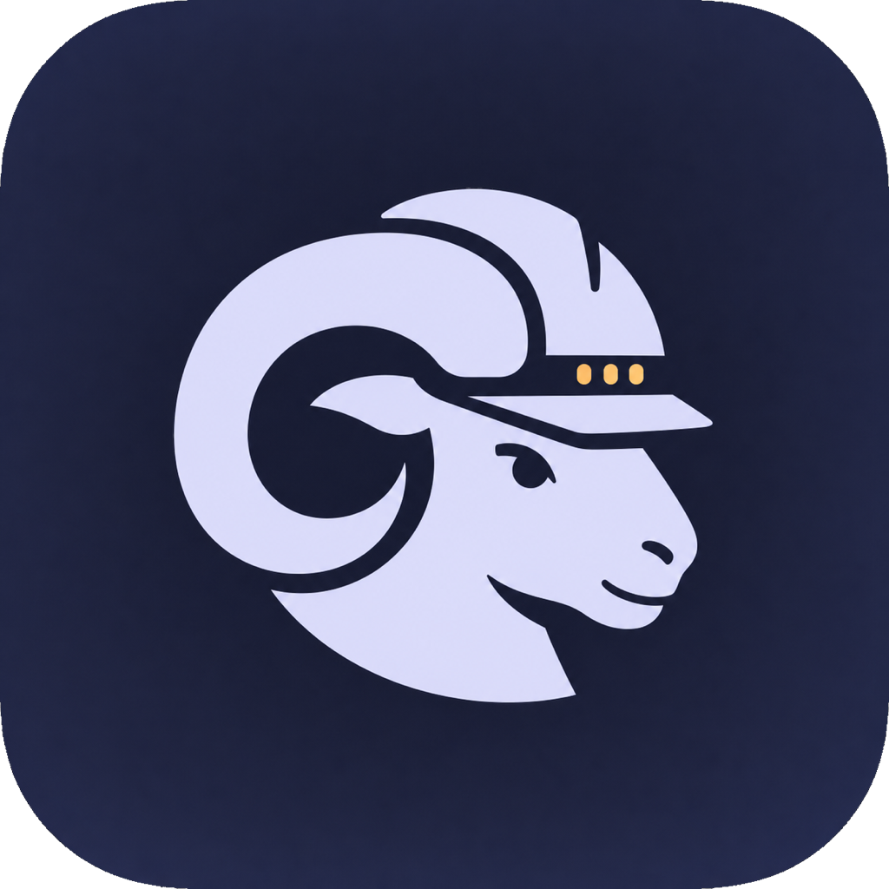

  
   
  <strong>Foreman</strong> 
  Live Herdr agent monitoring dashboard hardware

Foreman is a lightweight Raspberry Pi touchscreen interface that monitors live Herdr agents and focuses their panes with a tap.

The kiosk UI uses TypeScript and Preact, bundled into the Go binary with esbuild.

## Screenshots / Photos

## Install

- `mise run install-host` installs the Go service and native macOS menu-bar controller.
- `FOREMAN_SSH_TARGET=pi@raspberrypi.local mise run install-kiosk` installs the Chromium autostart entry, desktop launcher, and Raspberry Pi resource reporter. The target defaults to the `foreman` SSH alias.
- `mise run vnc-open` opens the Pi display through its local-only VNC server and an SSH tunnel.

The menu-bar app and kiosk settings page share the resource polling interval. Five seconds is the default; 10, 30, and 60-second intervals are also available. Compact mode fits up to 15 agent tiles at 800×480.

Installing a kiosk update closes an existing Foreman Chromium kiosk after replacing the files. Open the Foreman desktop launcher to start the updated version.

## Discovery and pairing

Foreman Macs advertise `_foreman._tcp.local` with Bonjour. The kiosk opens its local discovery page, lists every compatible Mac on the LAN, and uses each Mac's stable installation ID so DHCP address changes do not break the relationship.

To pair a kiosk:

1. Choose **Allow New Kiosk** from the Foreman menu on the Mac. Pairing remains open for three minutes.
2. Select that Mac on the kiosk and choose **Start pairing**.
3. Verify that both devices show the same six-digit code, then approve it on each device.

Each Mac can authorize multiple kiosks. A kiosk keeps a separate credential for every Mac, so **Settings → Switch Mac** reconnects to a previously paired computer without another code. The Mac menu can revoke one kiosk or all paired kiosks.

Pairing uses ephemeral P-256 ECDH and displays a short authentication string to detect a person-in-the-middle. The resulting 256-bit device secret and the Mac's TLS certificate fingerprint are encrypted during pairing. Dashboard and satellite traffic then use certificate-pinned TLS 1.3, while WebSocket upgrades additionally require a fresh HMAC signature, timestamp, and one-time nonce.

See [`docs/SECURITY.md`](docs/SECURITY.md) for the threat model, trust bootstrap, storage guarantees, and recovery behavior.

## Package build approval

`esbuild@0.28.1` is allowed to run its postinstall because it selects and verifies the platform binary. The reviewed release is OIDC trusted-published with SLSA provenance and a registry signature; its npm `gitHead` matches upstream tag `v0.28.1`, the tarball matches registry integrity, and `aube audit` reports no advisories.
